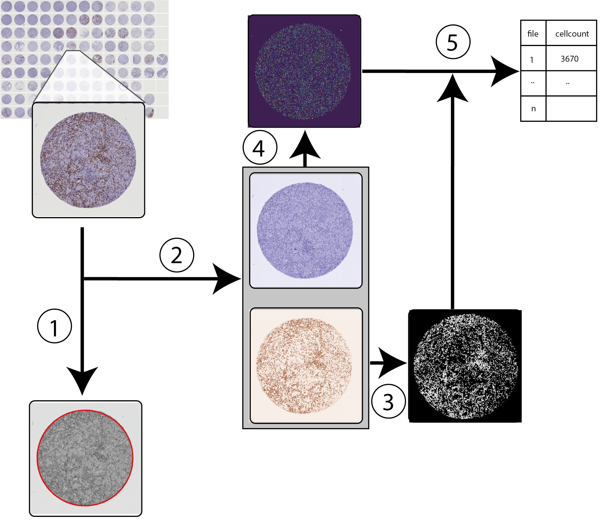

# TMArQ

## About

TMArQ, Tissue microarray MArker Quantification is a pipeline for automated quantification of antibody staining in TMA cores.
It can automatically process TMA core images of several markers taken from several TMA blocks. The user only needs to provide the name of the TMA block and marker directories.
TMArQ works as follows:

1) Detection of region of interest (ROI) using Hough circle detection.
2) Colour deconvolution to separate out the DAB staining from the hematoxylin staining.
3) Thresholding signal in the DAB layer to determine DAB absence/presence on the level of individual pixels.
4) Cell nuclei segmentation using starDist.
5) Combining starDist detected cells with the DAB staining layer to count IHC-stained cells in the core. 

 

## Installation

To use TMArQ you will first need to install conda, see https://docs.conda.io/projects/conda/en/latest/user-guide/install/index.html

To run the code in this repository, the easiest is to clone it and then install the requirements

```
git clone https://github.com/StaafLab/TMArQ
cd TMArQ
conda env create -f env/tmarq.yml
```

## Getting started

TMArQ comes with an exmaple data set. To run this example, activate the conda environment and run the workflow with snakemake. 

```
conda activate tmarq
snakemake -jall
```

## Specifying your own files

TMArQ expects individual core images under:
- data
  - blockname 
    - markername
 
 1. Specify your block and marker names in the config file, which is located in the directory config (see config_example.yml for an example).
 2. Specify the name of your config file in the Snakemake file (Snakefile). 

 TMArQ expects core images that are a bit over 3000x3000 pixels, as this is the standard dearrayed output from pathXL, a platform enabling digital pathology. If you want to update the image dimensions, you can easily do this in the tmaConfig.yml file under config.

 3. Then run your code as in the example above. You can specify the number of cpu cores you want to use for the run using the -j flag. In the example we use all available cores. 

```
conda activate tmarq
snakemake -jall
```

 The run will create a results directory with two intermediate outputs: 
 - core coordinates
 - total cell counts per core

## License

Copyright (C) 2023 Suze Roostee

This program is free software: you can redistribute it and/or modify it under the terms of the GNU General Public License as published by the Free Software Foundation, either version 3 of the License, or (at your option) any later version.

This program is distributed in the hope that it will be useful, but WITHOUT ANY WARRANTY; without even the implied warranty of MERCHANTABILITY or FITNESS FOR A PARTICULAR PURPOSE. See the GNU General Public License for more details.

You should have received a copy of the GNU General Public License along with this program. If not, see https://www.gnu.org/licenses/.


